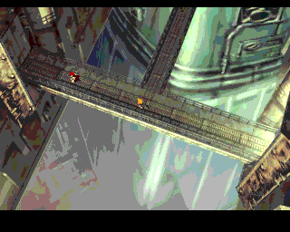
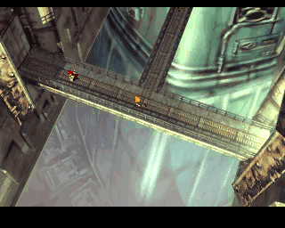
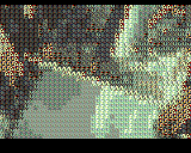

## Update, 24 Dec 2024

Check out [Part 2](pce-quant-2), where loading times get much improved!

---

## Introduction

I spend some time in the evenings working on various toy projects. It's a good way to exercise a programmer brain in a way that a day job generally doesn't.

<!-- truncate -->

Anyway, a while back I bought an [Analogue Duo](https://www.analogue.co/duo), which is a high quality FPGA clone of the old 8/16-bit [PC Engine](https://en.wikipedia.org/wiki/TurboGrafx-16) console.

I say 8/16 rather than just 16-bit, because while the GPU was 16-bit, the CPU was an 8-bit [HuC6280](https://en.wikipedia.org/wiki/Hudson_Soft_HuC6280) -- a derivative of the legendary 6502 CPU, with a bunch of handy extra instructions and so on. Oh, and 4 times the typical speed.

The PC Engine also had a CD-ROM expansion, which allowed plenty of storage. An almost unimaginable amount for the time.

## PC Engine graphics

The PC Engine's graphics were powered by the 16-bit [HuC6270](https://en.wikipedia.org/wiki/Hudson_Soft_HuC6270). The PC Engine was released shortly after the NES, and it's fair to describe its graphics capability as somewhere between the NES and Mega Drive.

Crucially, it's a tile-based system, where each tile is an 8x8 pixel pattern.

Tiles can use colours from any one palette out of the 16 background colour palettes, where each palette has 16 colours.

Each colour has a 3-bit red component, 3-bit green component, and 3-bit blue component, which gives rise to 512 possible colours.

There are 16 additional palettes just for sprites, but we'll ignore those.

That means up to 256 unique colours on screen, just for the background.

There's a Background Attribute Table ("BAT") at the start of VRAM, which describes which pattern is used for each of on-screen tiles. The BAT also describes which of the 16 palettes is assigned to each on-screen tile.

Since the palette indices are in the BAT rather than in the patterns, you could do the infamous Super Mario Bros. trick, where the clouds and bushes use the same tile patterns, just with different palettes.

To summarise:

- 16 palettes, each with 16 colours.
- 8x8 tiles, and each tile can use any palette.
- 3-bit colour depth.

## Motivation

I come from an Amiga background, where every on-screen colour has to be bought with compromises. Additionally, with Amiga disks being only 880 KB and hard drives not being standard for the platform, there wasn't much storage for graphics.

So, with up to 256 colours available for the background, and lots of storage on CD-ROM, why did many PC Engine CD games look... quite bad? They tended to use few colours, and the edges of tiles were very obvious.

Maybe there were limitations I hadn't considered? (Spoiler: Yes)

I set out to find out how good a PC Engine background could theoretically look. And by that, I mean using lots of colours, and lots of unique detail.

## Problem

The problem I wanted to solve was, to take an input image, convert it to tiles, select the best 16 palettes for the image, and write out the image as it would look on PC Engine.

I chose [this image of Final Fantasy VII from MobyGames](https://www.mobygames.com/game/858/final-fantasy-vii/screenshots/playstation/397288/), for a few reasons:

1. It's fairly low resolution, like the PC Engine
2. It's from a 32-bit console, setting a high bar for success
3. It uses loads of unique colours
4. There are subtle gradients
5. There are small areas with contrasting colours, such as around the characters


## Existing tools

There's an excellent online tool which does this kind of image processing:

https://rilden.github.io/tiledpalettequant/

Given an input image, it will generate an image with these kind of constraints -- tiles, palettes, low bits per channel.

The output image from the website isn't ready to use for any platform, so another tool would be required to convert the output to be usable on your platform of choice.

To match PC Engine specs, I changed some of the settings from defaults:

- Change Palettes from 8 to 16
- Change Colors per palette from 4 to 16
- Change Bits per channel from 5 to 3

Then, to improve the quality of the output:

- Change Dithering from "disabled" to "slow"

For comparison, here's the input image again, the quantized image generated by tiledpalettequant, and the generated palettes packed into an image:

Input image:


Image and palettes generated by tiledpalettequant:

 

The site does (in my opinion) an incredible job. Aside from the gradients at the bottom of the image, you would barely know it had been through such processing. I could have called it a day, but it's an interesting problem and I wanted to dive deeper.

I didn't like the dithering pattern all that much as I find the halftone pattern is quite visible. I think it's just too regular.

Some kind of dithering is required, as the 3-bit colour limitation is quite brutal. I wanted to experiment with an error diffusion-type of dithering.

Additionally I like command line tools so I can plumb them into a build process. A web-based tool doesn't really appeal to me.

The website also took about a minute to process the image, which was surprising.

I also really wanted to see the resulting image on a PC Engine/Analogue Duo or emulator.

So I wrote my own tool.

## Chosen technology: Rust

I'm a big fan of Rust for command line tools. There's a large ecosystem of packages ("crates"), and with Cargo there's no hassle integrating dependencies, you can get on with solving the problem at hand.

Some people don't like the Rust syntax, or the borrow checker, but I find that I rarely need to annotate lifetimes or types, and for tools with clear inputs and outputs, the borrow checker rarely gets in the way.

This isn't meant to be a Rust versus _whatever_ post, so I'll leave it at that.

## General algorithm

There might be a better way to do it, but I sketched out the following algorithm in `main()` and started implementing it:

1. Load true-colour image
2. Cut image into tile patterns
3. Find tiles with similar colours and group into 16 groups
4. For each group of tiles, find the palette which best fits the tiles in the group
5. For each true-colour tile, remap to the nearest colour in the palette (and dither)

## Loading and cutting the image into tiles

The first couple of steps in the general algorithm are fairly straightforward and not worh discussing in detail. I used the `png` crate to load the input image, and some `for` loops to iterate through the image data and store it in `Tile` structures.

I tried a bit to do it in a more elegant way, using [`chunks_exact()`](https://doc.rust-lang.org/std/primitive.slice.html#method.chunks_exact) and so on, but I never found an implementation that was as neat and tidy as just doing the `for` loops.

I won't paste it here, for fear of embarrassment!

```rust
pub struct ColorU8 {
    pub r: u8,
    pub g: u8,
    pub b: u8,
}

pub const TILE_SIZE: usize = 8;

pub struct TiledImage {
    pub width_in_tiles: usize,
    pub height_in_tiles: usize,
    pub tiles: Vec<Tile>,
}

pub type Tile = [[ColorU8; TILE_SIZE]; TILE_SIZE];
```

For clarity, the colours at this point are 8-bit true colour, rather than 3-bit, in order to avoid any rounding errors. Maybe it would be better to get the rounding over and done with early rather than late, but that's not how I approached it.

## Attempt 1: average colour per tile and colour space partitioning

### Grouping similar tiles

I had the idea of grouping similar tiles by computing the average colour for every tile, then building a [frequency distribution](<https://en.wikipedia.org/wiki/Frequency_(statistics)>) of those average colours, which is effectely a count of occurrences of each unique colour.

```rust
pub struct ColorDistribution {
    color_pixel_counts: BTreeMap<ColorU8, usize>,
}
```

The big drawback of this approach is that taking the average colour of each tile loses an awful lot of information about the range of colours in that tile.

I would then try to partition the distribution of average colours into 16 convex cells. Each cell would share the same palette.

The partitioning algorithm centred around the concept of a [BSP tree](https://en.wikipedia.org/wiki/Binary_space_partitioning), where each leaf was a colour distribution.

```rust
pub struct BspTree {
    pub leaves: Vec<ColorDistribution>,
}
```

I repeatedly picked the leaf with the largest number of colour occurrences, and split that leaf into 2 further leaves, until the total number of leaves reached 16, or the leaves couldn't be split any further.

To split a leaf, I computed the colour distribution component (red, green, or blue) with the largest range, the average colour of the leaf, and for each colour in the starting leaf, if the component was greater than average then it went in one new leaf, and if it was less, then it went in the other new leaf.

The result of all of that work was just 16 colours. For each tile, I then chose which of those colours was closest to the average colour of that tile, and that would be ideally be representative of the palette the tile should use.

### Generating palettes for tiles

Now that I've grouped "similar" tiles, I repeated the process to generate a palette for each group.

I took all of the pixel colours in each tile group, and computed another colour distribution. I again reduced each colour distribution down to 16 colours, and that would be the palette shared by the tiles in the group.

The result was 16 palettes of 16 colours, and a list of the tiles used by each palette.

For each tile, I then did a remapping of true colours to the nearest colour in the tile's palette. The result was something like this:


I was quite encouraged that the overall algorithm was successful, but two things really bothered me:

First, when grouping similar tiles, a huge amount of information was thrown away by taking the average colour per tile. I felt this was most noticeable in areas with saturated colour, such as the characters standing on the walkway. Where did the vibrant red and orange go?

The second thing that bothered me was the colour space partitioning algorithm, and how it only split the space into axis-aligned regions. Other than that, I was quite happy with the BSP approach.

## Attempt 2: _k_-means clustering

While I was impressed that someone with no experience in quantisation could just dive in and get decent results, I did some more investigation into the algorithms that "proper" paint packages use for this kind of processing.

I found [_k_-means clustering](https://en.wikipedia.org/wiki/K-means_clustering).

> _k_-means clustering is a method of vector quantization ... to partition _n_ observations into _k_ clusters ...

Well that sounded just like what I was trying to do. And there was a [`clustering`](https://crates.io/crates/clustering) crate which implemented this algorithm in a reusable way.

The crate's `kmeans()` function accepts a constant _k_ (the maximum number of clusters to generate), a list of _elements_ to cluster, and a maximum number of _iterations_ to run.

There were two types of clustering I was trying to do:

1. Clustering similar tiles
2. Clustering colours inside tile clusters

Each element is a vector of floating point numbers, so to cluster something, you need to represent it as a vector of some kind. For colours, a 3D red-green-blue works just fine, but for more complex elements, some other representation is needed.

To cluster similar tiles, I chose a vector of 6 values:

- Minimum red, green, and blue values
- Maximum red, green, and blue values

This representation seemed horribly basic, but not nearly so much as just clustering by the average colour. I figured it would capture the range of colours more effectively.

To cluster similar colours to generate a palette, I used the RGB components directly.

The result was quite impressive compared to my previous approach:



Note that the vibrant colours had returned, and the edges of tiles weren't nearly so visible.

There was still quite bad banding though, brought on by the 3-bit colour depth.

## Dithering

I implemented my own custom error-diffusion dithering method, where during the remapping phase (choosing pixel colours from an existing palette), I track the "error" (difference between the ideal colour and chosen colour) and try to correct some of that error when remapping the next pixel, by applying part of the error as a bias.

I didn't think that was particularly novel, so I won't go into more detail, but the end result worked pretty well:


## Testing in an emulator

Emboldened by my success, I felt that PC Engine games _could_ have looked much better than they did, so why didn't they?

I spent a long time learning how to program PC Engine things.

I modified my converter to dump out the image in a format that a PC Engine game could load into VRAM.

The data was quite large, using most of the 64K of VRAM that was available. I started to get nervous.

I then wrote a PC Engine CD program in [HuC](https://github.com/pce-devel/huc) that loaded the data from CD into VRAM. I felt CD was the way to go, as [HuCards](https://en.wikipedia.org/wiki/HuCard) are quite limited in size.

To my disappointment, it took about 6 seconds to load the data from CD. I guess there's no fast channel from CD to VRAM.

## Conclusion

I really enjoyed this hobby project. I found that PC Engine games left a lot of image quality on the table, but it wasn't without reason.

## Future work

I wonder if I could reduce the number of unique tile patterns, could I shrink the size of the data in VRAM? Perhaps some of the tiles are so similar that they could share patterns.

Perhaps the tool could be adapted and used for other platforms with more memory, or faster transfer speeds, such as Mega Drive or SNES.

## Bonus

To show why dithering was needed, here's the converter outputting an image with 8-bit colour rather than 3-bit:



You would barely know it was reduced to 16 palettes of 16 colours.

I added a fun debug toggle to the converter, so I could see which tiles used which palette:


