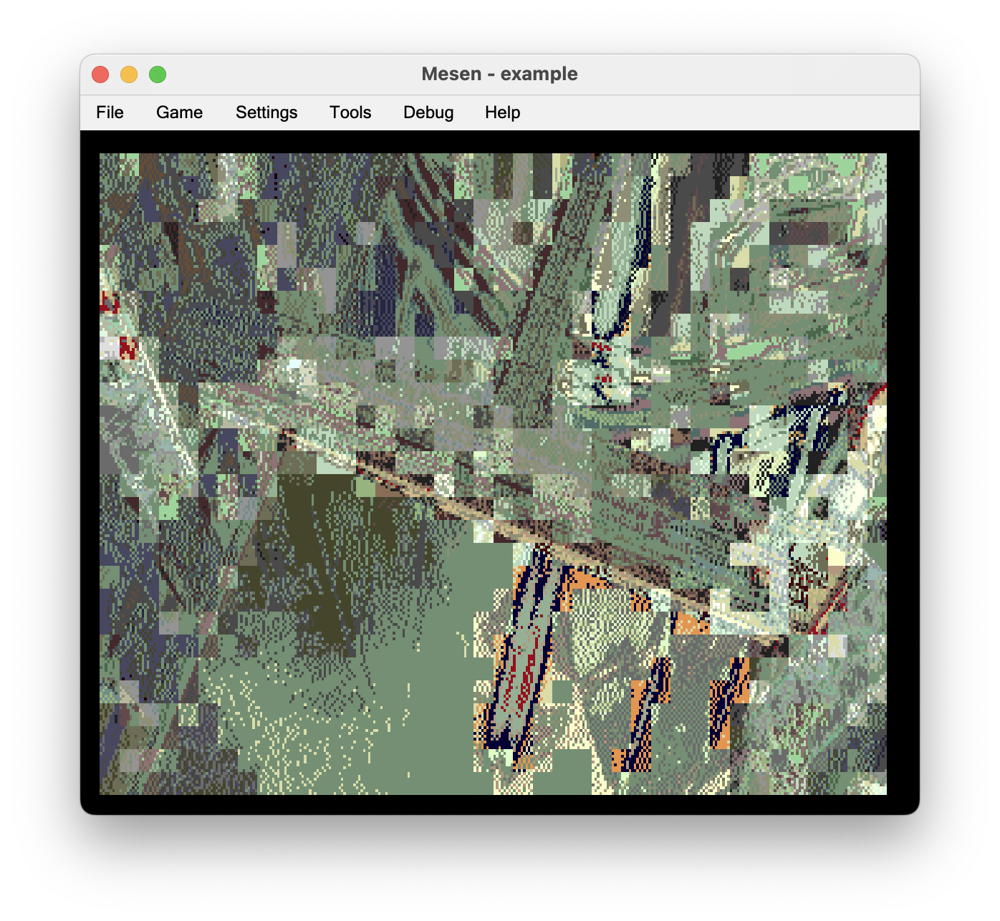
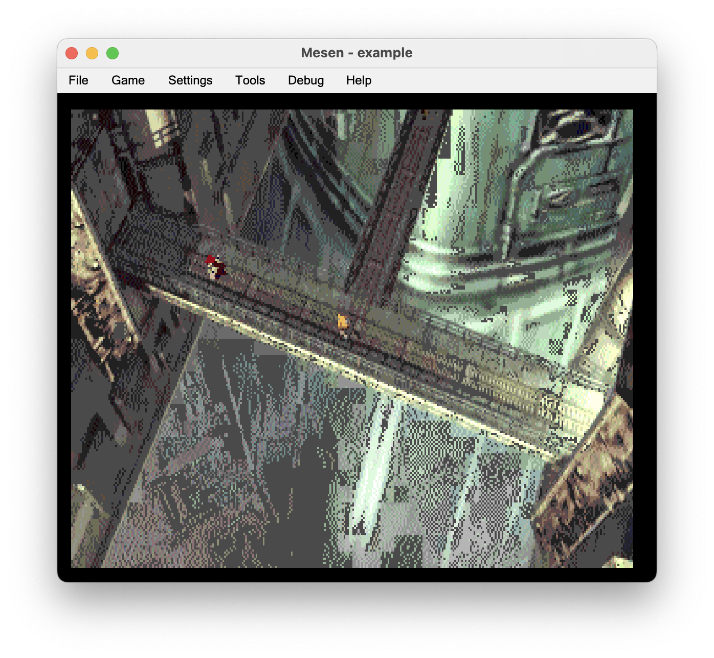
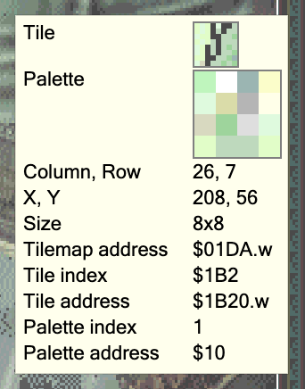
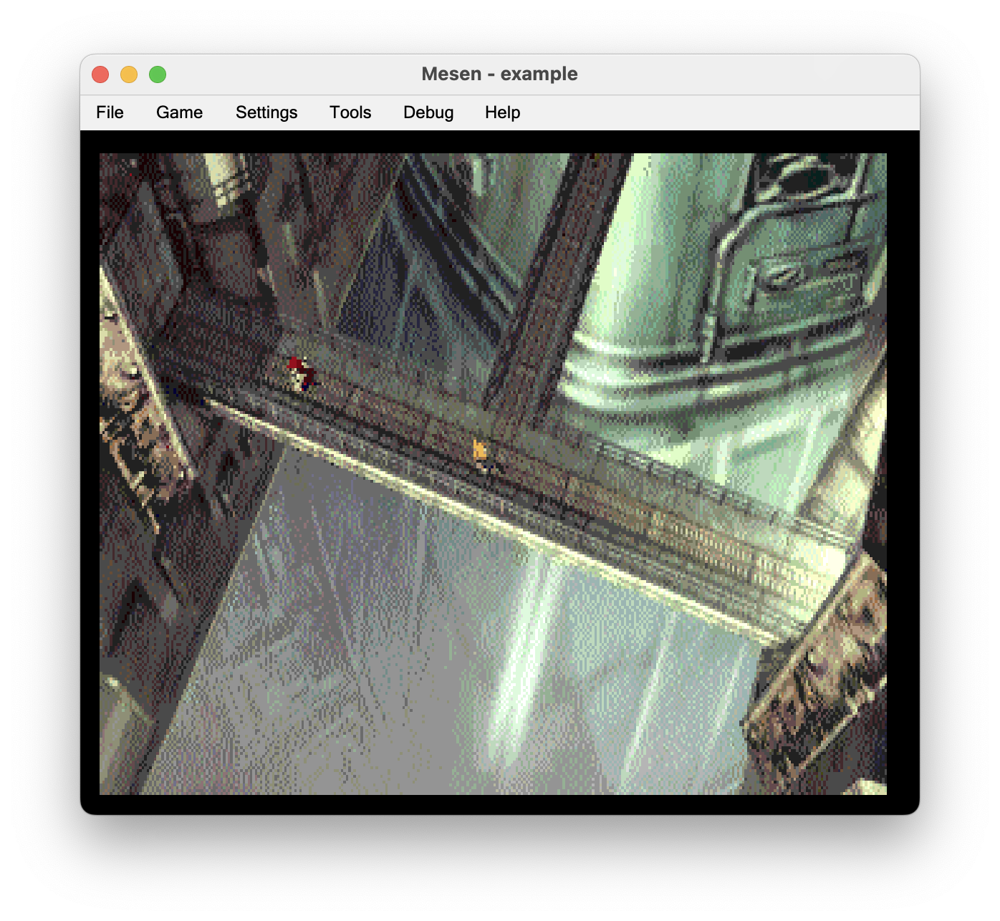

## Introduction

While exploring [PC Engine image quality and quantisation](../pce-quant/), I found that when loading an image from CD-ROM to VRAM, it took something like 6 seconds for the load to finish.

I thought this was a hardware limitation at the time, and supposed that this was the reason that PC Engine games from back in the day didn't feature more colourful background graphics.

## An unexpected correction

I was very grateful when prolific PC Engine developer **Elmer** corrected me:

[HuCC Development Chat Discord](https://discord.com/channels/697510903029039196/1318957530617221120/1320039602282696744)

> As for your problems with CD loading speed to VRAM ... the PC Engine can load from CD to VRAM quite happily at the full CD speed of 150KB/second, so if it was taking you 6 seconds to load an image, that's a problem with your loading code, such as loading into RAM, and then copying to VRAM in HuC, which will be horribly slow because one of the most-used HuC CD library routines uses a really stupid method of loading data from CD.

Not only that, but he updated the HuCC compiler's library with a new, faster function to load data from CD-ROM to VRAM:

> If you get the lastest build of HuCC/HuC from the pce-devel repo, you should be able to get full speed loading in HuCC by changing your loading call in example.c to `cd_fastvram(OVL_VIDEODATA, 0, 0, (VRAM_SIZE + 2047) >> 11);`

Now this was something I had to try. Just how fast _is_ full speed?

## The state of my PC Engine quantisation tool

Before I tried the new function, I still had some work to do in my quantisation tool.

I was able to convert the input PNG to 2 things:

1. A new PNG showing the quantised version of the image
2. A raw blob of VRAM data, which could then be loaded into VRAM from CD-ROM

What was missing, however, were the palettes needed to display the VRAM data correctly.

So I started adding palette export to the tool.

## Randomness

My tool used to work by converting the input image to either a PNG or a VRAM blob, but not both. When I added palette support, I added it in the same way, so the tool could save either the VRAM or the palettes but not both at the same time.

This was of course inefficient, because it would take 2 executions of the tool to generate the VRAM and then the palettes. But it worked with my build process, so I kept it this way.

I then hit a strange bug, when loading the palettes into my example program running in the Mesen PC Engine emulator.

For some reason, tiles were using the wrong palettes.

I puzzled over this for about an hour or so, never really figured it out, and went to bed.

Overnight it occurred to me, that every run of the tool seemed to generate a different set of palettes. Or at least, a different ordering. I inferred that the `clustering` crate I was using for _k_-means clustering may be using randomness in some way, so the palettes and ordering are not deterministic.

After scanning the source of the crate, I was able to confirm it.

I restructured my tool's command line parser and main function to support any of the export types in a run, and that problem went away.

I would have liked to also remove the non-determinism from `clustering`, but decided that I didn't want to take that work on yet. I'd gone off-course enough already.

## Background colour

I then noticied in the Mesen tile map debugger, that many of my tiles included a colour that was not in the palette for that tile. For example:

I asked again in the HuCC Discord, if the first colour of each palette was reserved, and **Elmer** again provided valuable information:

> Yes, the first entry in each palette is transparent, that's critical for putting low-priority sprites _behind_ the background. But the first palette entry of the first background palette is the color that's shown behind the background when there are no sprites.

I made some corrections to my quantisation tool, to reduce the number of colours per palette from 16 to 15, and to add 1 to each colour index when writing out the VRAM or palettes.

That fixed the problem.

There is now a bit of an image quality inefficiency, where the first palette only has 15 usable colours when it could have 16, but I thought that was a fair compromise, for a spare time effort.

Other palettes also inherit the background colour from the first palette, but I didn't make use of that.

## Back to loading speed

Now that I was able to load in the correct palettes, I tried out the new faster function to load data into VRAM.

Up until this point, I was using the **HuC** compiler. This compiler has since been superceded by the **HuCC** compiler.

I updated my `huc` submodule to the latest version, but found that the new function didn't exist for HuC, only for HuCC.

Migrating from HuC to HuCC was super simple, so thank you to the developers for that. All I needed to do was tweak the compiler path and include search path (`PCE_INCLUDE`) in my `Makefile`.

As was foretold, the load duration was much improved, dropping from 6 seconds, to well under a second.

## Conclusion

I found that PC Engine games could have had really nice quality backgrounds, and that the speed of loading was basically negligible.

This could have worked well for games such as point and click adventure games, RPGs, and other games where the background could be mostly static.

It would be interesting to see if tile-based games could make better use of more palettes too. It often appears like tile-based games use just a small number of palettes.
