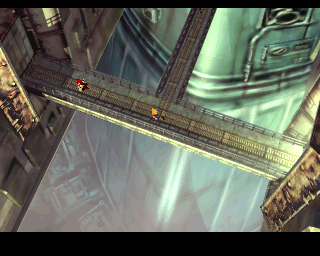
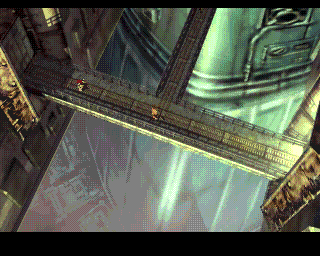
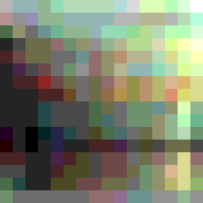

## Introduction

I spend some time in the evenings working on various toy projects. It's a good way to exercise a programmer brain in a way that a day job generally doesn't.

Anyway, a while back I bought an [Analogue Duo](https://www.analogue.co/duo), which is a high quality FPGA clone of the old 8/16-bit [PC Engine](https://en.wikipedia.org/wiki/TurboGrafx-16) console.

I say 8/16 rather than just 16-bit, because while the GPU was 16-bit, the CPU was an 8-bit [HuC6280](https://en.wikipedia.org/wiki/Hudson_Soft_HuC6280) -- a derivative of the legendary 6502 CPU, with a bunch of handy extra instructions and so on. Oh, and 4 times the typical speed.

The PC Engine also had a CD-ROM expansion, which allowed plenty of storage. An almost unimaginable amount for the time.

## PC Engine graphics

The PC Engine's graphics were powered by the 16-bit [HuC6270](https://en.wikipedia.org/wiki/Hudson_Soft_HuC6270). The PC Engine was released shortly after the NES, and it's fair to describe its graphics capability as somewhere between the NES and Mega Drive.

Crucially, it's a tile-based system, where each tile is an 8x8 pixel pattern.

Tiles can use colours from any one palette out of the 16 background colour palettes, where each palette has 16 colours.

Each colour has a 3-bit red component, 3-bit green component, and 3-bit blue component, which gives rise to 512 possible colours.

There are 16 additional palettes just for sprites, but we'll ignore those.

That means up to 256 unique colours on screen, just for the background.

There's a Background Attribute Table ("BAT") at the start of VRAM, which describes which pattern is used for each of on-screen tiles. The BAT also describes which of the 16 palettes is assigned to each on-screen tile.

Since the palette indices are in the BAT rather than in the patterns, you could do the infamous Super Mario Bros. trick, where the clouds and bushes use the same tile patterns, just with different palettes.

To summarise:

* 16 palettes, each with 16 colours.
* 8x8 tiles, and each tile can use any palette.
* 3-bit colour depth.

## Motivation

I come from an Amiga background, where every on-screen colour has to be bought with compromises. Additionally, with Amiga disks being only 880 KB and hard drives not being standard for the platform, there wasn't much storage for graphics.

So, with up to 256 colours available for the background, and lots of storage on CD-ROM, why did many PC Engine CD games look... quite bad? They tended to use few colours, and the edges of tiles were very obvious.

Maybe there were limitations I hadn't considered? (Spoiler: Yes)

I set out to find out how good a PC Engine background could theoretically look. And by that, I mean using lots of colours, and lots of unique detail.

## Problem

The problem I wanted to solve was, to take an input image, convert it to tiles, select the best 16 palettes for the image, and write out the image as it would look on PC Engine.

I chose [this image of Final Fantasy VII from MobyGames](https://www.mobygames.com/game/858/final-fantasy-vii/screenshots/playstation/397288/), for a few reasons:

1. It's fairly low resolution, like the PC Engine
2. It's from a 32-bit console, setting a high bar for success
3. It uses loads of unique colours
4. There are subtle gradients
5. There are small areas with contrasting colours, such as around the characters

## Existing tools

There's an excellent online tool which does this kind of image processing:

https://rilden.github.io/tiledpalettequant/

Given an input image, it will generate an image with these kind of constraints -- tiles, palettes, low bits per channel.

The output image from the website isn't ready to use for any platform, so another tool would be required to convert the output to be usable on your platform of choice.

To match PC Engine specs, I changed some of the settings from defaults:

* Change Palettes from 8 to 16
* Change Colors per palette from 4 to 16
* Change Bits per channel from 5 to 3

Then, to improve the quality of the output:

* Change Dithering from "disabled" to "slow"

For comparison, here's the input image again, the quantized image generated by tiledpalettequant, and the generated palettes packed into an image:

  

The site does (in my opinion) an incredible job. Aside from the gradients at the bottom of the image, you would barely know it had been through such processing. I could have called it a day, but it's an interesting problem and I wanted to dive deeper.

I didn't like the dithering pattern all that much as I find the halftone pattern is quite visible. I think it's just too regular.

Some kind of dithering is required, as the 3-bit colour limitation is quite brutal. I wanted to experiment with an error diffusion-type of dithering.

Additionally I like command line tools so I can plumb them into a build process. A web-based tool doesn't really appeal to me.

The website also took about a minute to process the image, which was surprising.

I also really wanted to see the resulting image on a PC Engine/Analogue Duo or emulator.

So I wrote my own tool.

## Chosen technology

I'm a big fan of Rust for command line tools. There's a large ecosystem of packages ("crates"), and with Cargo there's no hassle integrating dependencies, you can get on with solving the problem at hand.

Some people don't like the Rust syntax, or the borrow checker, but I find that I rarely need to annotate lifetimes or types, and for tools with clear inputs and outputs, the borrow checker rarely gets in the way.

## General algorithm

1. Load true-colour image
2. Cut image into tile patterns
3. Find tiles with similar colours and group into 16 groups
4. For each group of tiles, find the palette which best fits the tiles in the group
5. For each true-colour tile, remap to the nearest colour in the palette (and dither)

## First attempt: colour space partitioning

## Second attempt: k-means clustering

## Implementation

I'm a big fan of Rust for command line tools. There's a large ecosystem of packages ("crates"), so there's no hassle integrating dependencies, and you can get on with solving the problem at hand. Some people don't like the syntax, but I find that I rarely need to annotate lifetimes or types, so maybe it's a programming style thing.

## Results

## Testing in an emulator

## Conclusion
